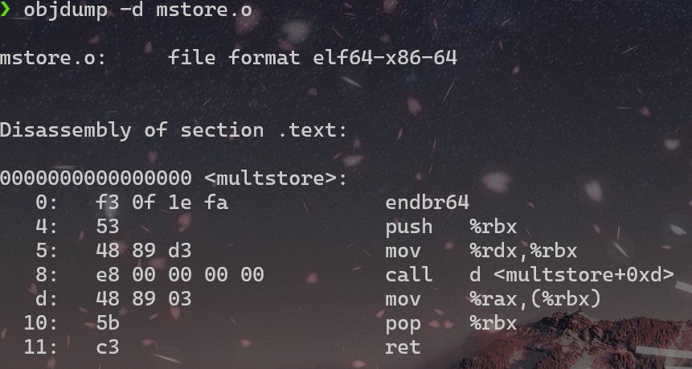
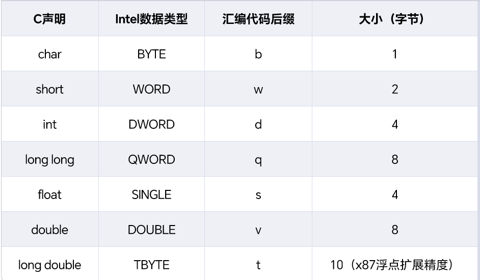
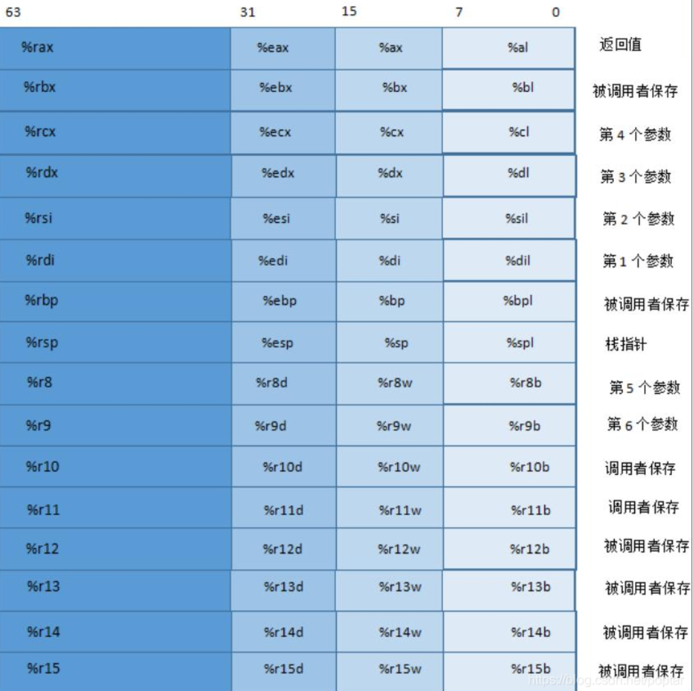
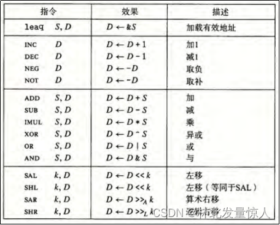
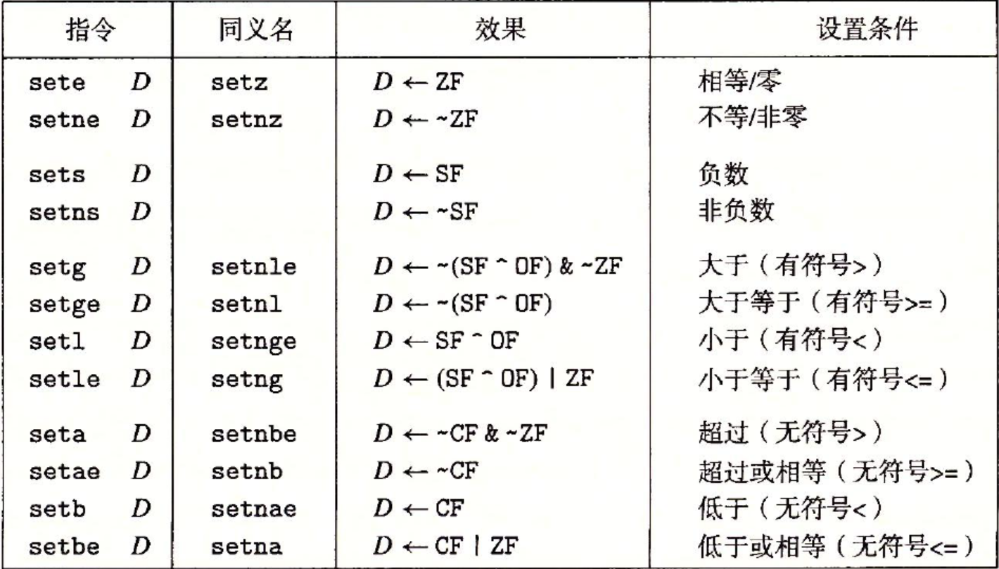
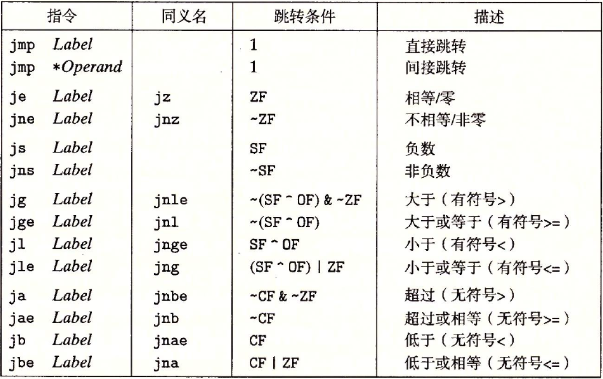
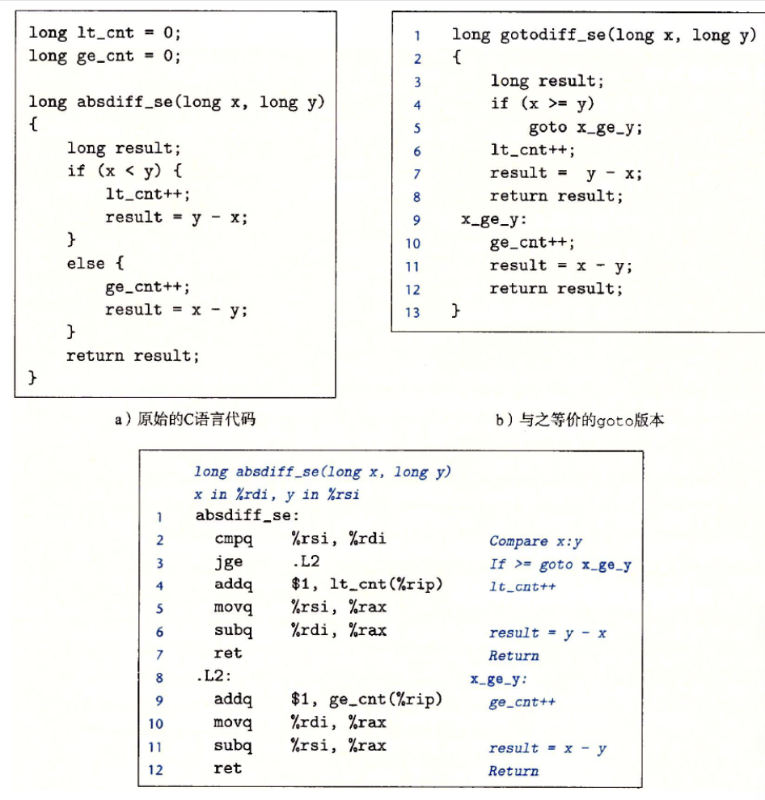
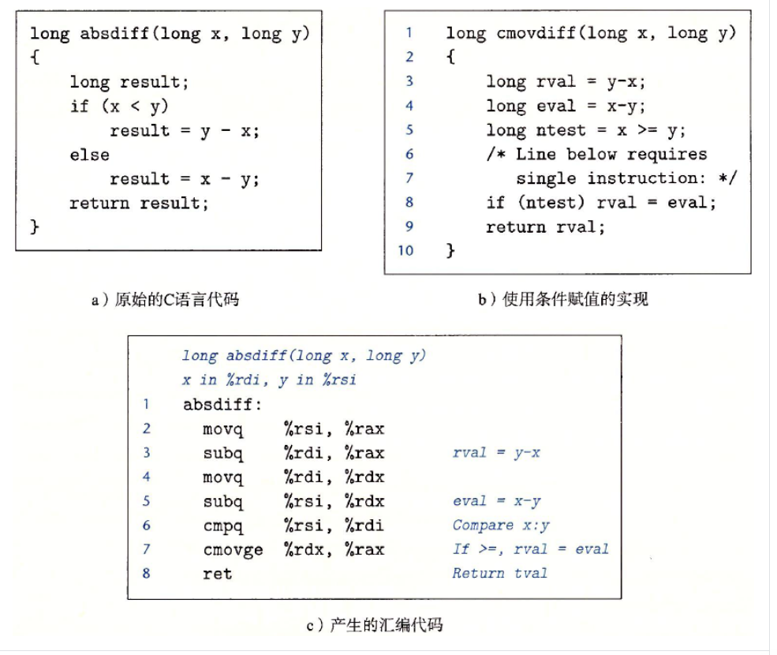

# 程序的机器机表示

## 3.2 程序编码

`linux> gcc -Og -o p p1.c p2.c`

**编译选项-Og**:告诉编译器使用会生成符合原始C代码整体结构的机器代码的优化等级

实际上，gcc命令调用了一整套程序，将源代码转化为可执行代码，将源代码转化成可执行代码。首先，C预处理器扩展源代码，插入所有用`#include`命令指定的文件，并扩展所有用`#define`声明指定的宏。

其次，编译器产生两个源文件的汇编代码，名字分别为`p1.s`和`p2.s`。

接下来，汇编器会将汇编代码转化成二进制目标代码文件`p1.o`和`p2.o`。目标代码是机器代码的一种形式，它包含所有指令的二进制表示，但是还没有填入全局值的地址

最后，连接器将两个目标代码文件与实现库函数（如printf）的代码合并，并产生最终的可执行代码文件p（由命令行指示符`-o p`指定的）

### 3.2.1 机器级代码

**指令集体系架构**或**指令集架构（ISA）**：定义机器级程序的格式和行为，它定义了处理器状态、指令的格式，以及每条指令对状态的影响。处理器的硬件并发的执行许多指令，但是可以采取措施保证整体行为与ISA指定的顺序执行的行为完全一致

机器级程序使用的内存地址是虚拟地址，提供的内存模型看上去是一个非常大的字节数组。存储器系统的实际实现是将多个硬件存储器的操作系统软件组合起来。

- **程序计数器**（通常称为PC，在x86-64中用%rip表示）：给出将要执行的下一条指令在内存中的地址
- 整数**寄存器**文件包含16个命名的位置，分别存储64位的值。这些寄存器可以存储地址（对应C语言的指针）或整数结构。有的寄存器被用来记录某些重要的程序状态，而其它的寄存器用来保存临时数据，例如过程的参数和局部变量，以及函数的返回值。
- 条件吗寄存器保存着最近执行的算数或逻辑指令的状态信息。他们用来实现控制或数据流中的条件变化，比如说用来实现if和while语句
- 一组向量寄存器可以存放一个或多个整数或浮点数值

机器代码只是简单的将内存看成一个很大的、按字节寻址的数组

较典型的程序只会访问几兆字节或几千兆字节的数据。操作系统负责管理虚拟地址空间，将虚拟地址翻译成实际处理器内存中的物理地址

### 3.2.2 代码示例

假设存在c语言代码文件`mstore.c`，包含如下的函数定义

```c
long mult2(long,long);

void multstore(long x,long y,long *dest)
{
    long t = mult2(x,y);
    *dest = t;
}
```

在命令行上使用`- S`选项，就能看到c语言编译器产生的汇编代码

`linux> gcc -Og -S mstore.c`

这会使GCC运行编译器，产生一个汇编文件`mstore.s`，但是不做其它进一步工作（通常情况下，它还会继续调用汇编器产生目标代码文件）

```assembly
mulstore:
    pushq   %rbx
    movq    %rdx,%rbx
    call    mult2
    movq    %rax,(%rbx)
    popq    %rbx
    ret
```

上面代码中，每个缩进去的行都对应于一条机器指令。比如，`pushq`指令表示应该将寄存器`%rbx`压入栈中。

如果按照`- c`命令行选项，GCC会编译并汇编该代码

`linux> gcc -Og -c mstore.c`

这就会产生目标代码文件`mstore.o`，它是二进制格式的，所以无法直接查看。1368字节的文件`mstore.o`中有一段14字节的序列，它的16进制表示为

`53 48 89 d3 e8 00 00 00 00 48 89 03 5b c3`

这就是上面列出的汇编指令对应的目标代码

综上，我们可以发现，机器执行的程序只是一个字节序列，它是对一系列指令的编码。

要查看机器代码文件的内容，带-d命令行的标志程序OBJDUMP可以充当这个角色



我们可以看到按照前面给出的字节顺序排列的14个16进制字节值，它们分成了若干组，每组1~5个字节。每组字节都已一条指令，右边是等价的汇编语言

一些关于机器代码和它的反汇编表示的特性：

- x86-64的指令长度从1到15字节不等。常用指令以及操作数较少的指令所需的字节数少
- 设计指令格式的方式是，从某个给定位置开始，可以将字节唯一解码成机器指令。例如，只有指令`pushq %rbx`是以字节值53开头的
- 反汇编器只是基于机器代码文件中的字节序列来确定汇编代码。它不需要访问该层徐的源代码或汇编代码
- 反汇编使用的命名规则与GCC生成的汇编代码使用的有些细微差别

生成实际可执行的代码需要对一组目标代码文件运行连接器，而这一组目标代码文件中必须包含有一个main函数

#### *如何展示程序的字节表示*

要展示程序的二进制目标代码，用反汇编器确定该过程的代码长度14字节。然后，在文件mstore.o上运行GDB，输入命令

`(gdb) x/14xb multstore`

这条命令告诉GDB显示（简写为'x'）从函数multstore所处地址开始的14个十六进制格式表示（也简写为x）的字节（简写为b）

### 3.2.3 关于格式的注解

使用`- S`生成mstore.s文件然后查看，完整内容如下

```assembly
 .file   "mstore.c"
        .text
        .globl  multstore
        .type   multstore, @function
multstore:
.LFB0:
        .cfi_startproc
        endbr64
        pushq   %rbx
        .cfi_def_cfa_offset 16
        .cfi_offset 3, -16
        movq    %rdx, %rbx
        call    mult2@PLT
        movq    %rax, (%rbx)
        popq    %rbx
        .cfi_def_cfa_offset 8
        ret
        .cfi_endproc
.LFE0:
        .size   multstore, .-multstore
        .ident  "GCC: (Ubuntu 11.4.0-1ubuntu1~22.04) 11.4.0"
        .section        .note.GNU-stack,"",@progbits
```

注意，所有以`.`开头的行都是指导汇编器和连接器工作的伪指令。这些行通常可以忽略。而为了更清楚地说明汇编代码，利用另一种格式编写

```assembly
void multstore(long x,long y,long *dest)
x in %rdi, y in %rsi, dest in %rdx
multstore:
    pushq   %rbx            Save %rbx
    movq    %rdx,%rbx       Copy dest to %rbx
    call    mult2           Call mult2(x,y)
    movq    %rax,(%rbx)     Store result at *dest
    popq    %rbx            Restore %rbx
    ret                     Return
```

## 3.3 数据格式



## 3.4 访问信息



### 3.4.1 操作数指示符

x86-64支持多种操作数格式，源数据值可以以常数形势给出，或是从寄存器或内存中读出。结果可以放在寄存器或内存中

- **立即数**：用来表示常熟值。在ATT格式的汇编代码中，立即数的书写方式是"$"后面跟一个用标准C表示法白哦是的整数，例如$-577。
- **寄存器**：它表示某个寄存器的内容，16个寄存器的低位1字节、2字节、4字节或8字节中的一个作为操作数，这些字节数分别对应于8位、16位、32位或64位
- **内存引用**：它会根据计算出来的地址（*有效地址*）访问某个内存位置。


### 3.4.2 数据传送指令

#### MOV类

这些指令把数据从源位置复制到目的为宗旨，不做任何变化。MOV类由4条指令组成：movb,movw,movl,movq。这些指令都执行同样的操作；主要区别在于它们操作的数据大小不同，分别是1、2、4、8字节

源操作数指定的值是一个立即数，存储在寄存器中或者内存中。目的操作数指定一个位置，要么是一个寄存器，要么是一个内存地址。x86-64加了一条限制，传送指令的两个操作数不能都指向内存位置。将一个之从一个内存位置复制大哦另一个内存位置需要两条指令——第一条指令将源值加载到寄存器中，第二条指令将该寄存器值写入目的位置。

大多数情况中，MOV指令只会更i性能目的操作指定的那些寄存器字节或内存位置。粗话了movl指令以寄存器作为目的时，它会把该寄存器的高位4字节设置为0

此外还有两类数据移动指令，在将较小的源值复制到较大的目的时使用，这些指令都是把数据从源（寄存器或内存内）复制到目的寄存器

#### movz

把目的中剩余的字节填充为0

- movzbw:将做了零扩展的字节传送到字
- movzbl:将做了零扩展的字节传送到双字
- ......

注意不存在把四字节源值零扩展为8字节的指令，这样的数据传送应该用以寄存器为目的的movl指令来实现。这一技术利用的属性是，生成4字节值并以寄存器作为目的的指令会把高4字节置为0.对于64位目标，所有三种源类型都有对应的符号拓展传送，而只有两种较小得源类型有零扩展传送

#### movs

把目的中剩余的字节符号扩展，将源操作的最高位进行复制

- movsbw:将做了符号扩展的字节传送到字
- ......
- cltq:把%eax符号扩展到%rax

### 3.4.4 压入和弹出栈数据

最后两个数据传送操作可以将数据压入程序栈中，以及从程序栈中弹出数据。栈是一种数据结构，可以添加或者删除值，不过需要遵循“后进先出”的原则。通过push操作把数据压入栈中，通过pop操作删除数据

它有一个属性：弹出的值永远是最近被压入而且仍然在栈中的值。

x86-64中，栈向下增长，这样一来，栈顶元素的地址是所有栈中元素地址中最低的。

***栈指针%rsp保存着栈顶元素的地址***.

`pushq`将数据压入到栈上，而且`popq`指令是弹出数据。这些指令都只有一个操作数——压入栈中的数据源和弹出的数据目的(四字)

将一个四字值压入栈中，首先要先将栈指针减八，然后将值写道新的栈顶地址。因此`pushq %rbp`的行为等价于

```assembly
subq $8,%rsp        下降栈指针
movq %rbp,(%rsp)    将%rbp存在栈上
```

它们的区别是在机器代码中pushq指令编码为1个字节，而上面那两条指令一共为8个字节

弹出一个四字的操作包括从栈顶位置读出数据，然后将栈指针加8。因此`popq %rbp`等价于

```assembly
movq (%rsp),%rax        从栈中读出rax的值
addq $8,%rsp            增加栈指针
```

## 3.5 算数和逻辑操作



### 3.5.1 加载有效地址

*加载有效地址*指令leaq实际上是movq指令的变形。它的指令形式式从内存读数据到寄存器，但实际上根本没有引用内存。

它的第一个操作数是将有效地址写入到目的操作数，而不是从指定的位置读入数据，**目的操作数必须是一个寄存器**

```c
long long scale(long x, long y, long z)
{
    long t = x + 4*y + 12*z;
    return t;
}
```

编译后leaq指令的实现算术运算

```asm
long scale(long x, long y, long z)
x in %rdi,y in %rsi,z in %rdx

scale：
    leaq    (%rdi,%rsi,4),%rax      x + 4*y
    leaq    (%rdx,%rdx,2),%rdx      z + 2*z = 3*z
    leaq    (%rax,%rdx,4),%rax      (x + 4*y) + 4*(3*z) = x + 4*y + 12*z
    ret
```

### 3.5.2 一元和二元操作

第二组中的操作是一元操作，只有一个操作数，既是源又是目的。这个操作数可以是一个寄存器，也可以是一个内存位置

第三组是二元操作，其最终，第二个操作数既是源又是目的，第一个操作数可以是立即数、寄存器或是内存位置；第二个操作数可以是寄存器或是内存位置

*当第二个数为内存地址时，处理器必须从内存中读出值，执行操作，再把结果写回内存*.

### 3.5.3 移位操作

最后一组是移位操作，先给出移位量，然后第二项给出的是要移位的数。可以进行算数和逻辑右移。移位量可以是一个立即数，或者放在单字节寄存器%cl中

移位量是由%cl寄存器的低m位决定的，这里 *2^m=w* ,高位会被忽略。所以若%cl的十六进制值为0xFF时，指令salb会移7位，salw会移15位，sall会移31位

## 3.6 控制

目前我们只考虑了直线代码的行为，也就是指令条接着一条顺序地执行（顺序结构）

机器代码提供两种基本地敌机机制来实现有条件地行为：测试数据值，然后根据测试地结果来改变控制流或者数据流

### 3.6.1 条件码

除了整数寄存器，CPU还维护着一组单个位地条件码（condition code）寄存器，它们描述了最近的算数或逻辑操作地属性，可以检测这些寄存器来执行条件分支指令。

- CF：进位标志.最近的操作使最高位产生了进位。可以用来检查无符号操作的溢出
- ZF：零标志。最近的操作得出的结果是0
- SF：符号标志。最近的操作得到的结果为负数
- OF：溢出标志。最近的操作导致一个补码溢出——正溢出或负溢出

比如说，假设我们用一条ADD指令完成等价于C表达式 t = a + b的功能，这里变量a、b和t都是整型的。然后根据下面的C表达式来设置条件码

```t
CF  (unsigned) t < (unsigned) a     无符号溢出
ZF  (t == 0)                        零
SF  (t<0)                           负数
OF  (a<0==b<0) && (t<0!=a<0)        有符号溢出
```

- leaq指令不会改变任何的条件码，因为它是用来进行地址计算的。
- 除此之外，之前`算数和逻辑操作`图表中的所有指令都会设置条件码。
- 对于移位操作，进位标志将设置为最后一个被移出的位，而溢出标志设置为0。
- INC和DEC指令会设置溢出和零标志，但是不会改变进位标志

还有两类指令只设置条件码而不改变任何其它寄存器

| 指令 | 基于 | 描述 |
|-------|-------|-------|
| cmpb S1,S2| S2-S1 | 比较字节 |
| testb S1,S2 | S1&S2 | 测试 |

- CMP指令根据两个操作数之差来设置条件码。除了不改变寄存器的值以外，其它行为和SUB是一样的。如果两个操作数相等，这些指令会将零标志设置为1
- TEST指令的行为和AND指令一样。典型用法为：两个操作数是一样的（例如，test %rax,%rax来检查%rax是负数、零还是正数），或其中的一个操作数是一个掩码，用来指示哪些位应该被测试

### 3.6.2 访问条件码

条件码通常不会直接读取，常用的使用方法有3种

- 可以根据条件码的某种组合，将一个字节设置为0或者1
- 可以条件跳转到程序的某个其它部分
- 可以有条件的传送数据

SET指令根据条件码的组合，将某一个字节设置为 0 或者 1 。指令名字后面的后缀指明了他们的功效和需要考虑的条件码组合的不同



SET指令的操作数是8个单字节寄存器之一，或是存储一个字节的存储器位置，然后将这个字节设置为 0 或 1。下面看一个典型的计算C语言表达式 x > y 的指令序列。

```c
int gt(int a, int b)
{
    return a < b;
}
```

对应的汇编指令

```assembly
int comp(data_t a,data_t b)
a in %rdi,b in %rsi
cmpq    %rsi,%rdi       # Compare a : b
setl    %al             # Set low-byte of %eax to 0 or 1
movzbl  %al, %eax       # Set remaining bytes of %eax to 0
ret
```

注意cmpq指令的比较顺序。虽然参数列出的顺序是先%rsi(b)再是%rdi(a),但实际上比较的是a和b。以及，movzbl指令会将%eax的高3个字节清零，还会把整个寄存器%rax的高四个字节都清零

注意机器代码如何区分有符号和无符号值是很重要的

### 3.6.3 跳转指令

*jump*指令会导致执行切换到程序中一个全新的位置。再汇编代码中，这些跳转的目的地通常用一个标号表明

```asm
  movq $0,%rax          Set %rax to 0
  jmp .L                Goto .L1
  movq (%rax),%rdx      Null pointer dereference (skipped)
.L1:
  popq %rdx             ump target
```

这里`jmp .L1`指令会使程序跳过`movq`指令，从`popq`指令继续执行

在产生目标代码文件时，汇编器会确定所有带标号指令的地址，并将跳转目标（目的指令的地址）编码为跳转指令的一部分



### 3.6.4 跳转指令的编码

在汇编代码中，跳转目标用符号标号书写。汇编器，以及后来的链接器，会产生跳转目标的适当编码。

跳转指令有几种不同的编码，但是最常用的都是PC相对的（PC-relative）。

也就是说，它们会将目标指令的地址与紧跟在跳转指令后面那条指令的地址之间的差作为编码。这些地址偏移量可以编码为1、2或4个字节。

第二种编码方式是给出绝对地址，用4个字节直接指定目标，汇编器和链接器会选择适当的跳转目的编码

当执行PC相对寻址的时候，程序计数器的值是跳转指令后面的那条指令的地址，而不是跳转指令本身的地址

### 3.6.5 用条件控制来实现条件分支

将条件表达式和语句从 C 语言翻译成机器代码，最常用的方式是结合有条件和无条件跳转。（另一种方式在 3.6.6 节中会看到，有写条件可以用数据的条件转移实现，而不是用控制的条件转移实现）。



a） C过程`absdiff_se`包含一个if-else语句

b） C过程`gotodiff_se`模拟了`goto`代码的控制

c）给出了产生的汇编代码

### 3.6.6 用条件传送来实现条件分支

实现条件操作的传统方法是通过使用控制的条件转移。当条件满足时，程序沿着一条执行路径执行，而当条件不满足时，就走另一条路径。这种机制简单而通用，但是在现代处理器上，它可能会非常低效

一种替代的策略是使用数据的条件转移。这种方法计算一个条件操作的两种结果，然后再根据条件是否满足从中选取一个。只有在一些受限制的情况这种，这种策略才可行，但是如果可行，就可以用一条简单的条件传送指令来实现它，条件传送指令更符合现代处理器的性能特性。

" />

a） C函数`absdiff`包含一个条件表达式

b） C函数`cmovdiff`模拟汇编代码操作

c） 给出产生的汇编代码


当条件满足时，指令把源值`s`复制到目的`R`。

同条件跳转不同，处理器无需预测测试结果就可以执行条件传送。处理器只是读源值（可能是内存中），检查条件码，然后要么更新目的寄存器，要么保持不变。

**为了理解如何通过条件数据传输来实现条件操作，考虑下面的条件表达式和赋值的通用形式**

```c
v = test-expr ? then-expr : else-expr;
```

用条件控制转移的标准方法来编译这个表达式会得到如下形式

```c
	if (!test-expr)
    	goto false;
	v = then-expr;
	goto done;
flase:
	v = else-expr;
done:
```

这段代码包含两个代码序列：一个对then-expr求值，另一个对else-expr求值。条件跳转和无条件跳转结合起来使用是为了保证只有一个序列执行

基于条件传送的代码，会对then-expr和else-expr都求值，最终值的选择基于对test-expr的求值，可以用下面的抽象代码描述

```c
v = then-expr;
ve = else-expr;
if (!t) v = ve
```

这个序列中的最后一条语句是用条件传送实现的——只有当测试条件t不满足时，ve的值才会被复制到v中

**注意**：不是所有的条件表达式都可以用条件传送来编译。如果两个表达式中的任意一个可能产生错误条件或者副作用，就会导致非法的行为

**作为说明，考虑下面的C函数**

```c
long cread(long *xp)
{
	return (xp ? *xp : 0);
}
```

这段代码似乎很适合被编译成使用条件传送，理由是：当指针为空时，将结果设置为0。于是，想当然的有了如下汇编代码（以下是错误演示）

```assembly
.long cread(long *xp)
.xp in %rdi
cread:
  movq (%rdi),%rax ; v = *xp
  testq %rdi,%rdi ; Test x
  movl $0,%edx ; Set ve = 0
  cmove %rdx, %rax; ; If x==0, v = ve
  ret ; Return v
```

不过，这个实现是非法的，因为即使当测试为假时，`movq`指令（第二行）对于xp的简介引用还是发生了，导致一个间接引用空指针的错误。所以必须用分支代码来编译这段代码

编译环境为`gcc (Ubuntu 11.4.0-1ubuntu1~22.04) 11.4.0`,编译指令为`gcc -Og -S test.c`

```assembly
cread:
.LFB0:
        .cfi_startproc
        endbr64
        testq   %rdi, %rdi
        je      .L3
        movq    (%rdi), %rax
        ret
.L3:
        movl    $0, %eax
        ret
        .cfi_endproc
```

使用条件传送也不总是会提高代码的效率。例如，如果 `then-expr` 或者 `else-expr` 的求值需要大量的计算，那么当相对应的条件不满足时，这些工作就白费了。编译器必须考虑浪费的计算和由于分支预测错误所造成的性能处罚之间的相对性能

总的来说，条件数据传送提供了一种条件控制转移来实现条件操作的替代策略。它们只能用于非常受限制的情况，但是这些情况还是相当常见的，而且与现代处理器的运行方式更契合。

### 3.6.7 循环

C 语言提供了多种循环结构，即 `do-while`、`while` 和 `for`。汇编中没有相应的指令存在，可以用条件测试和跳转组合起来实现循环效果。GCC 和其他汇编器产生的循环代码主要基于两种基本的循环模式。

1. `do-while`循环

`do-while`语句的通用形式如下;

```c
do
    body-statement
    while (test-expr)
```

这种通用形式可以被翻译为如下所示的条件和`goto`语句

```c
loop:
	body-statement
    t = test-expr;
	if (t)
        goto loop;
```

每次循环，程序会执行循环体里的语句，然后执行测试表达式。如果测试为真，就回去再执行一次循环


2. `while`循环

`while`语句的通用形式如下：

```c
while (test-expr)
    body-statement
```

第一种翻译方法，称之为跳转到中间，它执行一个无条件跳转跳到循环结尾处的测试，以此来执行初始的测试。翻译为`goto`代码如下

```c
	goto test;
loop:
	body-statement
test:
	t = test-expr;
	if (t)
        goto loop;

```


