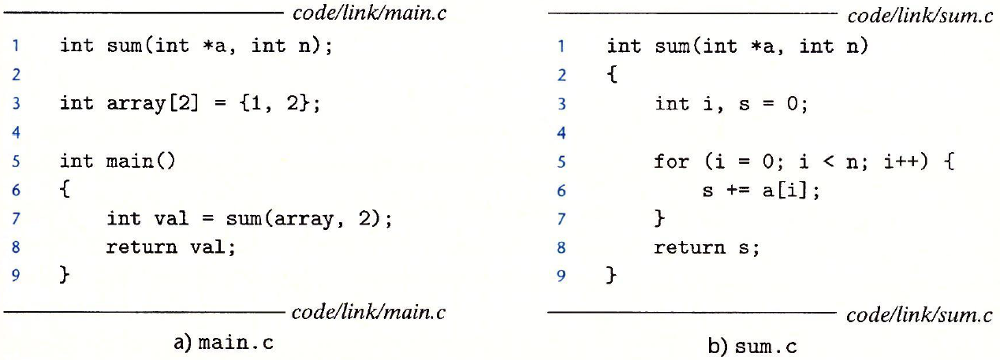

# 第7章 链接

链接（linking)是将各种代码和数据片段收集并组合成为一个单一文件的过程，这个文件可被加载（复制）到内存中并执行

现代系统中，链接是由叫做链接器的程序自动执行的。它们使得分离编译成为可能。我们不用将一个大型的应用程序组织为一个巨大的源文件，而是可以把它分解为更小的、更好管理的模块，可以独立地修改和编译这些模块。当改变这些模块中地一个时，只需要简单地重新编译他，并重新链接应用，而不必重新编译其它文件

为什么学习链接知识：

- 理解链接帮助构造大型程序
- 理解链接将帮助避免一些危险的编程错误。
- 理解链接将帮助理解语言的作用域规则是如何实现的
- 理解链接将帮助理解其它重要的系统概念（加载和运行程序、虚拟内存、分页、内存映射）
- 可以利用共享库

*环境：`linux x86-64`操作系统，标准`ELF-64`*

## 7.1 编译器驱动程序

|  |
| ------------------------------------------------------------ |
| 图 7-1 示例程序 1.                                           |

大多数编译系统提供编译器驱动程序`(compiler driver)`，它代表用户在需要时调用语言预处理器、编译器、汇编器和链接器。

> 比如，要通过GNU编译系统构造示例程序，我们就要通过在shell中输入下列命令来驱动GCC驱动程序
>
> `linux> gcc -Og -o prog main.c sum.c`

|  |
| :----------------------------------------------------------: |
| 图 7-2 静态链接。链接器将可重定位目标文件组合起来，形成一个可执行目标文件 `prog`。 |

图7-2介概括了驱动程序在将示例程序从ASCII码源文件翻译成可执行目标文件时的行为

> 若想看看这些步骤，可以用`-v`选项来运行GCC
>
> 驱动程序首先运行C预处理器（`cpp`），它将C的源程序`main.c`翻译成一个ASCII码的中间文件`main.i`:
>
> `cpp [other arguments] main.c /tmp/main.i`
>
> 接下来，驱动程序运行C编译器(`ccl`)，它将`main.s`翻译成一个ASCII汇编语言文件`main.s`：
>
> `ccl /tmp/main.i -Og [other arguments] -o /tmp/main.s`
>
> 然后，驱动程序运行汇编器(`as`)，它将`main.s`翻译成一个*可重定位目标文件*`main.o`
>
> `as [other arguments] -o /tmp/main.o /tmp/main.s`
>
> 驱动程序经过相同的过程生成`sum.o`，最后，它运行链接器程序`ld`，将`main.o`和`sum.o`以及一些必要的系统目标文件组合起来，创建一个*可执行目标文件*`prog`：
>
> `ld -o prog [other object files and args] /tmp/main.o /tmp/sum.o`
>
> 最后生成了名为`prog`的可执行文件

shell调用操作系统中一个叫做加载器`loader`的函数，它将可执行文件`prog`中的代码和数据复制到内存，然后将控制转移到这个程序的开头

## 7.2 静态链接

想`Linux LD`程序这样的静态链接器以一组可重定位目标文件和命令行参数作为输入，生成一个完全链接的、可以加载和运行的可执行文件作为输出。输入的可重定位目标文件由各种不同的代码和数据节组成，每一节都是一个连续的字节序列。

指令在一节中、初始化了的全局变量在另一节中，而未初始化的变量又在另外一节中。

为了构造可执行文件，连接器必须完成两个主要任务：

- **符号解析**：目标文件定义和引用符号，每个符号对应于一个函数、一个全局变量或一个静态变量。符号解析的目的是将每个符号引用正好和一个符号定义关联起来
- **重定位**：编译器和汇编器生成从地址0开始的代码和数据节。链接器通过把每个符号定义与一个内存位置关联起来，从而重定位这些节，然后修改所有对这些符号的引用，使得它们指向这个内存位置。连接器使用汇编产生的重定位条目的详细指令，不加甄别的执行这样的重定位

**关于链接器的一些基本事实**：

- 目标文件纯粹是字节块的集合。这些块中，有些包含程序代码，有些包含程序数据，而其它的则包含引导链接器和加载器的数据结构。链接器将这些块连接起来，确定被连接块的运行时位置，并且修改代码和数据块中的各种位置

## 7.3 目标文件

目标文件有三种形式：

- 可重定位目标文件：包含二进制代码和数据，其形式可以在连接时与其它可重定位目标文件合并起来，创建一个可执行目标文件
- 可执行目标文件：包含二进制代码和数据，其形式可以被直接复制到内存并执行
- 共享目标文件：一种特殊类型的可重定位目标文件，可以在加载或者运行时被动态的加载进内存并链接

编译器和汇编器生成可重定位目标文件（包括共享目标文件），链接器生成可执行目标文件。从技术上来说，一个目标模块就是一个字节序列，而一个目标文件就是一个以文件形式存放在磁盘中的目标模块，但这些术语会互换地使用

目标文件是按照特定地目标文件格式来组织的，各个系统的目标文件格式都不相同。

- 从贝尔实验室诞生的第一个Unix系统使用的是`a.out`格式
- Windows使用可移植可执行（Portable Executable,PE）格式
- Mac-OS-X使用`Mach-O`格式
- 现代x86-64 Linux和Unix系统使用可执行可链接格式（ELF）

**不管哪种格式，基本概念是相似的**

## 7.4 可重定位目标文件

|  |
| :----------------------------------------------------------: |
|              图 7-3 典型的 ELF 可重定位目标文件              |

该图展示了一个典型的ELF可重定位目标文件的格式，ELF头以一个16字节的序列开始，这个序列描述了生成该文件的系统的字的大小和字节顺序。ELF头剩下的部分包含帮助链接器语法分析和解释目标文件的信息。其中包括ELF头的大小、目标文件的类型