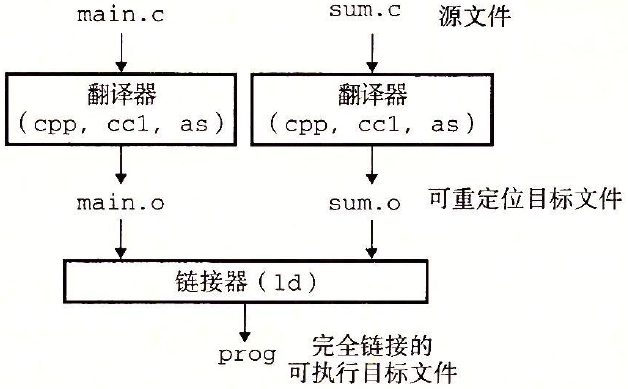
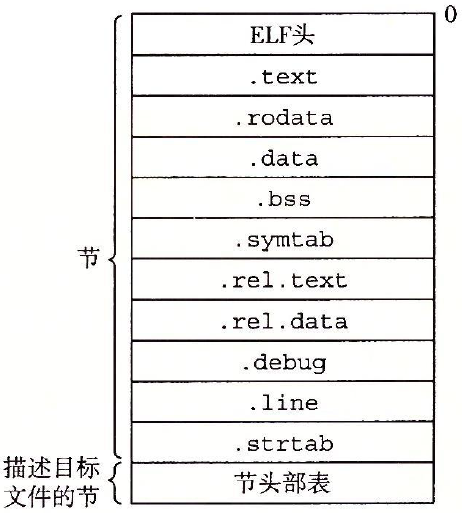
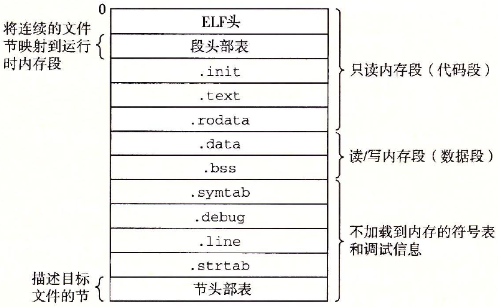
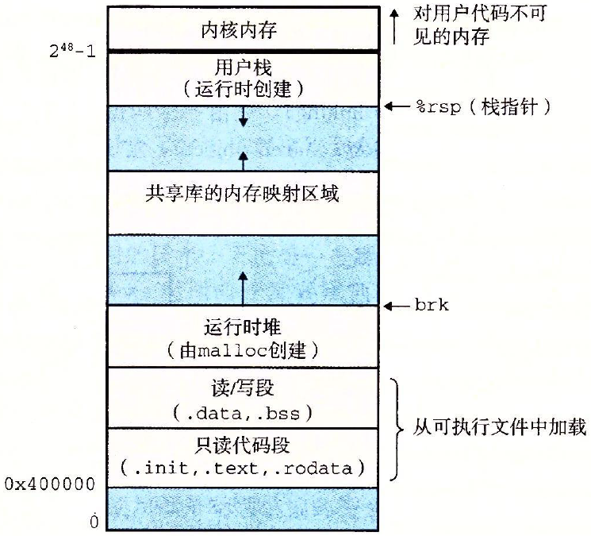
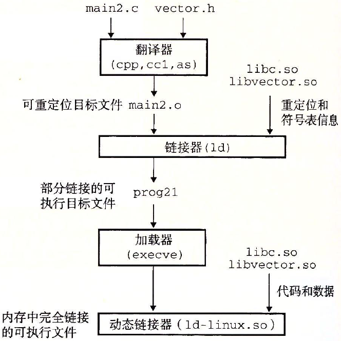

# 第7章 链接

链接（linking)是将各种代码和数据片段收集并组合成为一个单一文件的过程，这个文件可被加载（复制）到内存中并执行

现代系统中，链接是由叫做链接器的程序自动执行的。它们使得分离编译成为可能。我们不用将一个大型的应用程序组织为一个巨大的源文件，而是可以把它分解为更小的、更好管理的模块，可以独立地修改和编译这些模块。当改变这些模块中地一个时，只需要简单地重新编译他，并重新链接应用，而不必重新编译其它文件

为什么学习链接知识：

- 理解链接帮助构造大型程序
- 理解链接将帮助避免一些危险的编程错误。
- 理解链接将帮助理解语言的作用域规则是如何实现的
- 理解链接将帮助理解其它重要的系统概念（加载和运行程序、虚拟内存、分页、内存映射）
- 可以利用共享库

*环境：`linux x86-64`操作系统，标准`ELF-64`*

## 7.1 编译器驱动程序

|  |
| ------------------------------------------------------------ |
| 图 7-1 示例程序 1.                                           |

大多数编译系统提供编译器驱动程序`(compiler driver)`，它代表用户在需要时调用语言预处理器、编译器、汇编器和链接器。

> 比如，要通过GNU编译系统构造示例程序，我们就要通过在shell中输入下列命令来驱动GCC驱动程序
>
> `linux> gcc -Og -o prog main.c sum.c`

|  |
| :----------------------------------------------------------: |
| 图 7-2 静态链接。链接器将可重定位目标文件组合起来，形成一个可执行目标文件 `prog`。 |

图7-2介概括了驱动程序在将示例程序从ASCII码源文件翻译成可执行目标文件时的行为

> 若想看看这些步骤，可以用`-v`选项来运行GCC
>
> 驱动程序首先运行C预处理器（`cpp`），它将C的源程序`main.c`翻译成一个ASCII码的中间文件`main.i`:
>
> `cpp [other arguments] main.c /tmp/main.i`
>
> 接下来，驱动程序运行C编译器(`ccl`)，它将`main.s`翻译成一个ASCII汇编语言文件`main.s`：
>
> `ccl /tmp/main.i -Og [other arguments] -o /tmp/main.s`
>
> 然后，驱动程序运行汇编器(`as`)，它将`main.s`翻译成一个*可重定位目标文件*`main.o`
>
> `as [other arguments] -o /tmp/main.o /tmp/main.s`
>
> 驱动程序经过相同的过程生成`sum.o`，最后，它运行链接器程序`ld`，将`main.o`和`sum.o`以及一些必要的系统目标文件组合起来，创建一个*可执行目标文件*`prog`：
>
> `ld -o prog [other object files and args] /tmp/main.o /tmp/sum.o`
>
> 最后生成了名为`prog`的可执行文件

shell调用操作系统中一个叫做加载器`loader`的函数，它将可执行文件`prog`中的代码和数据复制到内存，然后将控制转移到这个程序的开头

## 7.2 静态链接

想`Linux LD`程序这样的静态链接器以一组可重定位目标文件和命令行参数作为输入，生成一个完全链接的、可以加载和运行的可执行文件作为输出。输入的可重定位目标文件由各种不同的代码和数据节组成，每一节都是一个连续的字节序列。

指令在一节中、初始化了的全局变量在另一节中，而未初始化的变量又在另外一节中。

为了构造可执行文件，连接器必须完成两个主要任务：

- **符号解析**：目标文件定义和引用符号，每个符号对应于一个函数、一个全局变量或一个静态变量。符号解析的目的是将每个符号引用正好和一个符号定义关联起来
- **重定位**：编译器和汇编器生成从地址0开始的代码和数据节。链接器通过把每个符号定义与一个内存位置关联起来，从而重定位这些节，然后修改所有对这些符号的引用，使得它们指向这个内存位置。连接器使用汇编产生的重定位条目的详细指令，不加甄别的执行这样的重定位

**关于链接器的一些基本事实**：

- 目标文件纯粹是字节块的集合。这些块中，有些包含程序代码，有些包含程序数据，而其它的则包含引导链接器和加载器的数据结构。链接器将这些块连接起来，确定被连接块的运行时位置，并且修改代码和数据块中的各种位置

## 7.3 目标文件

目标文件有三种形式：

- 可重定位目标文件：包含二进制代码和数据，其形式可以在连接时与其它可重定位目标文件合并起来，创建一个可执行目标文件
- 可执行目标文件：包含二进制代码和数据，其形式可以被直接复制到内存并执行
- 共享目标文件：一种特殊类型的可重定位目标文件，可以在加载或者运行时被动态的加载进内存并链接

编译器和汇编器生成可重定位目标文件（包括共享目标文件），链接器生成可执行目标文件。从技术上来说，一个目标模块就是一个字节序列，而一个目标文件就是一个以文件形式存放在磁盘中的目标模块，但这些术语会互换地使用

目标文件是按照特定地目标文件格式来组织的，各个系统的目标文件格式都不相同。

- 从贝尔实验室诞生的第一个Unix系统使用的是`a.out`格式
- Windows使用可移植可执行（Portable Executable,PE）格式
- Mac-OS-X使用`Mach-O`格式
- 现代x86-64 Linux和Unix系统使用可执行可链接格式（ELF）

**不管哪种格式，基本概念是相似的**

## 7.4 可重定位目标文件

|  |
| :----------------------------------------------------------: |
|              图 7-3 典型的 ELF 可重定位目标文件              |

该图展示了一个典型的ELF可重定位目标文件的格式，ELF头以一个16字节的序列开始，这个序列描述了生成该文件的系统的字的大小和字节顺序。ELF头剩下的部分包含帮助链接器语法分析和解释目标文件的信息。其中包括ELF头的大小、目标文件的类型（如可重定位、可执行或者共享的）、机器类型（如x86-64）、节头部表的文件偏移，以及节头部表中条目的大小和数量。不同节的位置和大小是由节头部表描述的，其中目标文件中每个节都有一个固定大小的条目

夹在ELF头和节头部表之间的就是节。一个典型的ELF可重定位目标文件包含下面几个节：

- `.text:`**已编译程序的机器代码**
- `.rodata`:**只读数据**，比如`printf`语句中的格式串和开关语句的跳转表
- `.data`：**已初始化的全局和静态C变量**。局部C变量在运行时被保存在栈中，既不出现在`.data`节中，也不出现在`.bss`节中。
- `.bss`:**未初始化的全局和静态C变量**，以及所有被初始化为0的全局或静态变量。在目标文件中这个节不占据实际空间，它仅仅是一个占位符。目标文件格式区分已初始化和未初始化变量是为了空间效率：在目标文件中，未初始化变量不需要占据任何和实际的磁盘空间。运行时，在内存中分配这些变量，初始值为0
- `.symtab`:**符号表**，它存放在程序中定义和引用的函数和全局变量的信息。每个可重定位目标文件`.symtab`中都有一张符号表。然而，和编译器中的符号表不同，`.symtab`符号表不包含局部变量的条目
- `.rel.text`：**一个`.text`节中位值的列表**，当链接器把这个目标文件和其它文件组合时，需要修改这些位置。一般而言，任何调用外部函数或者引用全局变量的指令都需要修改。另一方面，调用本地函数的指令则不需要修改。
- `.rel.data`:**被模块引用或定义的所有全局变量的重定位信息**。一般而言任何已初始化的全局变量，如果它的初始值是一个全局变量地址或者外部定义函数的地址，都需要被修改
- `debug`:**一个调试符号表**：其条目是程序中定义的局部变量和类型定义，程序中定义和引用的全局变量，以及原始的C源文件。*只有以`-g`选项调用编译器驱动程序时才会得到这张表*
- `.line`：原始C源程序中的行号和`.text`节中机器指令之间的映射。*只有以`-g`选项调用编译器驱动程序时才会得到这张表*
- `.strtab`:**一个字符串表**，其内容包括`.symtab`和`.debug`节中的符号表，以及节头部中的节名字。字符串表就是以null结尾的字符串序列

## 7.5 符号和符号表

每个可重定位的目标模块m都有一个符号表，它包括m定义和引用的符号信息。在链接器的上下文中，有三种不同的符号：

- 由模块m定义并能被其它模块引用的全局符号。全局链接器符号对应于非静态的C函数和全局变量
- 由其它模块定义并被模块m引用的全局符号。这些符号称为外部符号，对应于在其他模块中定义的非静态C函数和全局变量
- 只被模块m定义和引用的局部符号。它们对应于带`stastic`属性的C函数和全局变量。这些符号在模块m中任何位置都可见，但是不能被其它模块引用

`.symtab`中的符号表不不包含对应于本地非静态程序变量的任何符号。这些符号在运行时在栈中被管理，链接器对此类符号不感兴趣

定义为带C `static`属性的本地过程变量是不在栈中管理的。相反，编译器`.data`或`.bss`中为每个定义分配空间，并在符号表中创建一个由唯一名字的本地链接器符号

> **在C中，源文件扮演模块的角色**，任何带有`static`属性声明的全局变量或者函数都是模块私有的。任何不带`static`属性声明的全局变量和函数都是公共的，可以被其它模块访问

## 7.6 符号解析

链接器解析符号引用的方法是：将每个引用与它输入的可重定位目标文件的符号表中的一个确定的符号定义关联起来

### 7.6.1 链接器如何解析多重定义的全局符号

链接器的输入是一组可重定位目标模块。每个模块定义一组符号，如果多个模块定义同名的全局符号，`Linux`编译系统会采取以下方法:

在编译时，编译器向汇编器输出每个全局符号，或者是强或者是弱，而汇编器把这个信息隐含地编码在可重定位目标文件的符号表里。**函数和已初始化的全局变量是强符号，未初始化的全局变量是弱符号**

根据强弱符号的定义，`Linux`链接器使用下面的规则来处理多重定义的符号名：

- 不允许有多个同名的强符号
- 如果有一个强符号和多个弱符号同名，那么选择强符号
- 如果有多个弱符号同名，从这些弱符号中任意选择一个

使用像 `GCC-fno-common` 标志这样的选项调用链接器，这个选项会告诉链接器，在遇到多重定义的全局符号时，触发一个错误。或者使用 `-Werror` 选项，它会把所有的警告都变为错误

### 7.6.2 与静态链接库

所有的编译系统都提供一种机制，将所有相关的目标模块打包成为一个单独的文件，称为*静态库*，它可以用作链接器的输入。当链接器构造一个输出的可执行文件时，它只复制静态库里被应用程序引用的目标模块

静态库概念被提出来，相关的函数可以被编译为独立的目标模块，然后封装成一个单独的静态库文件。然后，应用程序可以通过命令行上指定单独的文件名字来使用这些在库中定义的函数

> 比如，使用C标准库和数学库中函数的程序可以用形式如下的命令行来编译和链接
>
> `linux> gcc main.c /usr/lib/libm.a /usr/lib/libc.a`

在链接时，链接器将只复制被程序引用的目标模块，这就减少了可执行文件在磁盘和内存中的大小。另一方面，应用程序员只需要包含较少的库文件的名字

在Linux系统中，静态库以一种称为*存档*的特殊文件格式存放在磁盘中，存档文件是一组连接起来的可重定位目标文件的集合，有一个头部用来描述每个成员目标文件的大小和位置。存档文件名由后缀`.a`标识

### 7.6.3 链接器如何使用静态库来解析引用

Linux链接器使用解析外部引用的方式，在符号解析阶段，链接器从左到右按照它们在编译器驱动程序命令行上出现的顺序来扫描可重定位目标文件和存档文件（驱动程序自动将命令行中所有`.c`文件翻译为`.o`文件）在这次扫描中，链接器维护一个**可重定位目标文件的集合E**（这个集合中的文件会被合并起来形成可执行文件），**一个未解析的符号**（即引用了但是尚未定义的符号）集合U,以及**一个在前面输入文件中已定义的符号集合D**。初始时，E、U和D均为空

- 对于命令行上的每个输入文件f，链接器会判断f是一个目标文件还是存档文件。
- 如果f是一个目标文件，那么链接器把f添加到E，修改U和D来反映f中的符号定义和引用，并继续下一个输入文件
- 如果f是一个存档文件，那么链接器就尝试匹配U中未解析的符号和由存档文件成员定义的符号。
  - 如果某个存档文件成员m,定义了一个符号来解析U中的一个引用，那么就将m添加到E中，并且链接器修改U和D来反映m中的符号定义和引用。
  - 对存档文件中所有的成员目标文件都依次进行这个过程，直到U和D都不再发生变化。此时，任何不包含在E中的成员目标文件都简单地被丢弃，而链接器继续处理下一个输入文件
  - 当链接器完成对命令行上输入文件的扫描后，U是非空的，那么链接器就会输出一个错误并终止。否则，它会合并和重定位E中的目标文件，构建输出的可执行文件

> 所以会产生一些错误：如果定义一个符号的库出现在引用这个符号的目标文件之前，那么引用就不能被解析，链接就会失败

## 7.7 重定位

一旦链接器完成了符号解析这一步，就把代码中的每个符号引用和正好一个符号定义（即它的一个输入目标模块中国的一个符号表条目）关联起来。此时，链接器就知道它的输入目标模块中的代码节和数据节的确切大小。现在就可以开始**重定位**步骤了，在这个步骤中，将**合并输入模块，并为每个符号分配运行时地址**

大致分为两步：

- **重定位节和符号定义**：在这一步中，链接器将所有相同类型的节合并为同一类型的新的聚合节。

  > 例如：来自所有输入模块的`.data`节被全部合并成一个节，这个节成为输出的可执行目标文件的`.data`节。然后，链接器将运行时内存地址赋给新的聚合节，赋给输入定义模块定义的每个节，以及赋给输入模块定义的每个符号。当这一步完成时，程序中的每条指令和全局变量都有唯一的运行时内存地址了

- **重定位节中的符号引用**：在这一步中，链接器修改代码节和数据节中对每个符号的引用，使得它们指向正确的运行时地址。要执行这一步，链接器依赖于可重定位目标模块中称为*重定位条目*的数据结构

### 7.7.1 重定位条目

当汇编器生成一个目标模块时,他并不知道数据和代码最终将存放在内存中的什么位置.它也不知道这个模块引用的任何外部定义的函数或者全局变量的位置.所以,无论何时汇编器遇到对最终位置未知的目标引用,它就会生成一个`重定位条目`,告诉链接器再将目标文件合并成可执行文件时如何修改这个引用.代码的重定位条目在`.rel.text`中.已初始化数据的重定位条目在`.rel.data`中

### 7.7.2 重定位符号引用

## 7.8 可执行目标文件

图 7-13 概括了一个典型的 ELF 可执行文件中的各类信息。

|  |
| ------------------------------------------------------------ |
| 图 7-13 典型的 ELF 可执行目标文件                            |

可执行目标文件的格式类似于可重定位目标文件的格式.ELF头描述文件的总体格式.它还包括程旭的入口点,也就是当程序运行时要执行的第一条指令的地址.`.text`,`.rodata`和`.data`节与可重定位目标文件中的节是相似的,除了这些节已经被重定位到它们最终的运行时内存地址以外.

## 7.9 加载可执行目标文件

要运行可执行目标文件`prog`,可以在Linux Shell的命令行中输入它的名字:`linux> ./prog`

因为`prog`不是一个内置的shell命令,所以shell会认为`prog`是一个可执行目标文件,通过调用某个驻留在存储器中称为加载器的操作系统代码来运行它.

每个Linux程序都有一个运行时的内存映像,如图7-15所示

|  |
| ------------------------------------------------------------ |
| 图 7-15 Linux x86-64 运行时内存映像。没有展示出由于段对齐要求和地址空间布局随机化（ASLR）造成的空隙。区域大小不成比例 |

在程序头部表的引导下,加载器将可执行文件的片(chunk)复制到代码段和数据段.接下里,加载器跳转到程序的入口点,也就是`_start`函数的地址,这个函数是在系统目标文件`ctrl.o`中定义的,对所有的C程序是一样的,`_start`函数调用系统启动参数`__libc_start_main`,该函数定义在`libc.so`中.它初始化执行环境,调用用户层的`main`函数,处理`mian`函数的返回值,并在需要的时候把控制返回给内核

## 7.10 动态链接共享库

静态库仍然有一些明显的缺点。静态库和所有的软件一样，需要定期维护和更新，如果下你更要使用一个库的最新版本，必须以某种方式了解到该库的更新情况，然后显式地将程序与更新了的库重新链接。另一个问题是，几乎每个C程序都使用标准I/O函数，比如`printf`和`scanf`在运行时，这些函数的代码会被复制到每个运行进程的文本段中，在一个运行上百个进程的典型系统上，这将是对稀缺的内存系统资源的极大浪费

**共享库**是致力于解决静态库缺陷的一个现代创新产物。共享库是一个目标模块，在运行或加载时，可以加载到任意的内存地址，并和一个在内存中的程序连接起来。这个过程称为**动态链接**，是由一个叫做**动态链接器**的程序来执行的。共享库也成为**共享目标**，在Linux系统中通常用`.so`后缀来表示，微软的操作系统大量地使用了共享库，它们称为DLL（动态链接库）

共享库是以两种不同的方式来“共享”的。首先，在任何给定的文件系统中，对于库只有一个`.so`文件。所有引用该库的可执行目标文件共享这个`.so`文件中的代码和数据，而不是像静态库的内部那样被复制和嵌入到引用他们的可执行文件中。其次，在内存中，一个共享库的`.text`节的一个副本可以被不同的正在运行的进程共享

|  |
| ------------------------------------------------------------ |
| 图 7-16 动态链接共享库                                       |

> 图7-16概括了图7-7示例程序的动态链接过程。为了构造图7-6中示例向量例程的共享库`libvector.so`,我们调用编译器驱动程序，给编译器和链接器如下特殊指令
>
> `linux> gcc -shared -fpic -o libvector.so addvec.c multvec.c`
>
> `-fpic`选项指示编译器生成与位置无关的代码；`-shared`选项指示链接器创建一个共享的目标文件一旦创建了这个库，随后就要把它链接到图7-7的示例程序中
>
> `linux> gcc -o prog21 main2.c ./libvector.so`
>
> 这样就创建了一个可执行目标文件`prog21`，而此文件的形式使得它在运行时可以和`libvector.so`链接。基本的思路是当创建可执行文件时，静态执行一些链接，然后在程序加载时，动态完成链接过程
>
> 此时没有任何`libvector.so`的代码和数据节真的被复制到可执行文件`prog21`中。反之，链接器复制了一些重定位和符号表信息，它们使得运行可以解析对`libvector.so`中代码和数据的引用
>
> 当加载器加载和运行可执行文件`prog21`时，它利用7.9节中讨论过的技术，加载部分链接的可执行文件`prog21`。接着，它注意到`prog21`包含一个`.interp`节，这一节包含动态链接器的路径名，动态链接器本身就是一个共享目标。加载器不会像它通常所做的那样将控制传递给应用，而是加载和运行这个动态链接器。然后，动态链接器通过执行下面的重定位完成连接任务：
>
> - 重定位`libc.so`的文本和数据到某个内存段
> - 重定位`libvector.so`的文本和数据到另一个内存段
> - 重定位`prog21`中所有对由`libc.so`和`libvector.so`定义的符号的引用
>
> 最后，动态链接器将控制传递给应用程序。从这个时候开始，共享库的位置就固定了，并且在程序执行的过程中都不会改变

## 7.11 从应用程序中加载和链接共享库

应用程序还可能在它运行时要求动态链接器加载和链接某个共享库，而无需在编译时将那些库链接到应用中。

## 7.12 位置无关代码

共享库的一个主要目的就是允许多个正在运行的进程共享内存中相同的库代码，因而节约宝贵的内存资源。

为了避免占用过多内存资源，现代系统以这样一种方式编译共享模块的代码段，使得可以把它们加载到内存的任何位置而无需链接器修改。实用这种方法，无限多个进程可以共享一个共享模块的代码段的单一副本

可以加载而无需重定位的代码称为位置无关代码（Position-Independent Code，PIC），对 GCC 使用 `-fpic` 选项指示 GNU 编译系统生成 PIC 代码，**共享库的编译必须总是使用该选项**。

### 1. PIC数据引用

编译器通过这样一个事实来生成对全局变量PIC的引用：无论我们在内存的何处加载一个目标模块（包括共享目标模块），数据段与代码段的距离总是保持不变。因此，代码段中任何指令和数据段中任何变量之间的*距离*都是一个运行时常量，域代码段和数据段的绝对内存位置是无关的

## 7.13 库打桩机制

Linux 链接器支持库打桩`（library interpositioning）`，它允许你截获对共享库函数的调用，取而代之执行自己的代码。使用打桩机制，可以追踪对某个特殊库函数的调用次数，验证和追踪它的输入和输出值，甚至把它替换成一个完全不同的实现。

打桩可以发生在编译时、链接时或当程序被加载和执行的运行时。

### 7.13.1 编译时打桩

由于有 `-I.` 参数，所以会进行打桩。

### 7.13.2 链接时打桩

Linux 静态链接器支持用 `--wrap f` 标志进行链接时打桩。

### 7.13.3 运行时打桩

编译时打桩需要能够访问程序的源代码，链接时打桩需要能够访问程序的可重定位对象文件。有一种机制能够在运行时打桩，它只需要能够访问可执行目标文件，这个很厉害的机制基于动态链接器的 `LD_PRELOAD` 环境变量。

## 7.14 处理目标文件的工具

## 7.15 小结

链接可以在编译时由静态编译器来完成，也可以在加载时和运行时由动态链接器来完成。链接器处理称为目标文件的二进制文件，它有 3 中不同的形式：可重定位的、可执行的和共享的。

链接器的两个主要任务是符号解析和重定位：符号解析将目标文件中的每个全局符号都绑定到一个唯一的定义；重定位确定每个符号的最终内存地址，并修改对那些目标的引用。
