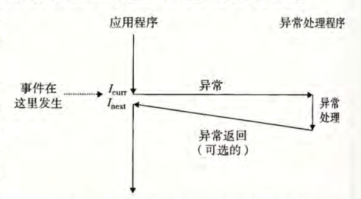
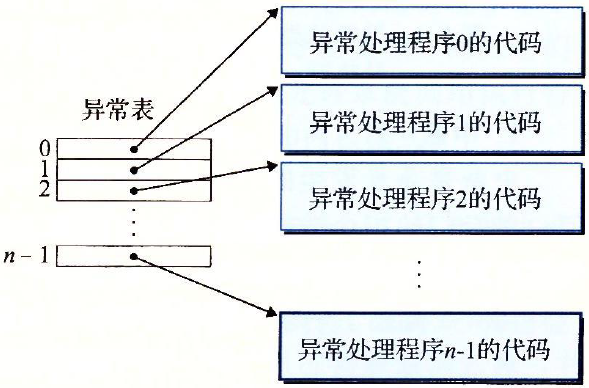
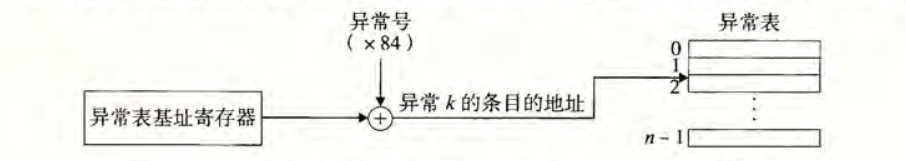
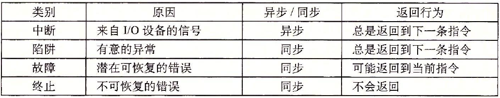
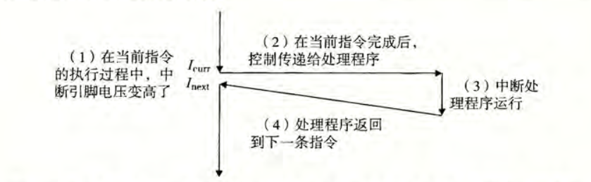
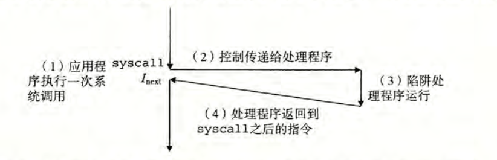

# CSAPP 第8章 异常控制流

从给处理器加电开始，直到断电为止，程序计数器假设一个值的序列：`a0, a1, ... ,an-1`，其中，每个 `ak` 是某个相应的指令 `Ik` 的地址。每次从 `ak` 到 `ak+1` 的过渡称为控制转移（control transfer），这样的控制转移序列叫做处理器的控制流（flow of control 或 control flow）。

最简单的一种控制流是一个“平滑的”序列，其中每个 `Ik` 和 `Ik+1` 在内存中都是相邻的。这种平滑流的**突变**（也就是 `Ik+1` 与 `Ik` 不相邻）通常是由诸如跳转、调用和返回这样一些程序指令造成的。这样一些指令都是必要的机制，使得程序能够对由程序变量表示的内部程序状态中的变化做出反应。

但是系统也必须能够对系统状态的变化做出反应，这些系统状态不是被内部程序变量捕获的，而且也不一定要和程序的执行相关。比如，一个硬件定时器定期产生信号，这个事件必须得到处理。包到达网络适配器后，必须存放在内存中。程序向磁盘请求数据，然后休眠，直到被通知说数据已就绪。当子进程终止时，创建这些子进程的父进程必须得到通知。

*异常控制流*（ECF）是指现代系统通过使控制流发生突变来队这些情况做出反应。

- *理解ECF可以帮助理解重要的系统概念*。ECF是操作系统用来实现I/O、进程和虚拟内存的基本机制
- *帮助理解应用程序是如何与操作系统交互的*。应用程序通过使用一个叫做*陷阱（trap)*或者*系统调用（system call)*的ECF形式，向操作系统请求服务。比如，向磁盘写数据、从网络读取数据、创建一个新进程，以及终止当前进程，都是通过应用程序调用系统调用来实现的
- *编写有趣的新应用程序*。操作系统为应用程序提供了强大的ECF机制，用来创建新进程、等待进程终止、通知其它进程系统中的异常时间，以及检测和响应这些事件。
- *理解并发*。ECF是计算机系统中实现并发的基本机制。在运行中的并发的例子有：中断应用程序执行的异常处理程序，在时间上重叠执行的进程和线程，以及中断应用程序执行的信号处理程序
- *理解软件异常如何工作*。C++和Java这样的语言通过try、catch和throw语句来提供软件异常机制。软件异常允许程序进行非本地跳转（即违法通常的调用/返回栈规则的跳转）来响应错误情况

## 8.1 异常

异常是异常控制流的一种形式，它一部分由硬件实现，一部分由操作系统实现。具体细节随系统的不同而不同

*异常*就是控制流中的突变，用来响应处理器状态中的某些变化。如图8-1所展示的基本思想

|  |
| ------------------------------------------------------------ |
| 图8-1 异常的剖析。处理器状态中的变化（事件）触发从应用程序到异常处理程序的突发的控制转移。在异常处理程序完成处理后，它将控制返回给被中断的程序或者终止 |

当异常处理程序完成后，根据引起异常的事件的类型，会发生以下三种情况的一种

1. 处理程序将控制返回给当前程序*I~current~*,即当事件发生时正在执行的指令
2. 处理程序将控制返回给*I~next~*,如果当前没有发生异常将会执行的下一条指令
3. 处理程序终止被中断的程序

### 8.1.1 异常处理

系统种可能的每种类型的异常都分配了一个唯一的非负整数的*异常号*。其中一些号码是由处理器的设计者分配的，其它号码是由操作系统**内核**（操作系统常驻内存的部分）的设计者分配的。

在系统启动时，操作系统分配和初始化一张称为**异常表**的跳转表，使得表目k包含异常k的处理程序的地址

|  |
| ------------------------------------------------------------ |
| 图 8-2 异常表                                                |

在运行时（系统执行某个程序时），处理器检测到发生了一个事件，并且确定了异常号k。随后，处理器触发异常，方法是执行间接过程调用，通过异常表的表目k，转到相应的处理程序。图8-3展示了处理器如何使用异常表来形成适当的异常处理程序的地址。异常表的起始地址放在一个叫做**异常表基址寄存器**的特殊CPU寄存器中

|  |
| ------------------------------------------------------------ |
| 图8-3 生成异常处理程序的地址。异常号时异常表中的索引         |

异常类似于过程调用，不同之处

- 过程调用时，在跳转到处理程序之前，处理器将返回地址压入栈中。然而，根据异常的类型，返回地址要么时当前指令（当事件发生时正在执行的指令），要么下一条指令
- **处理器也把一些额外的处理器状态压到栈里，在处理程序返回时，重新开始执行被中断的程序会需要这些状态。**

- 如果控制从用户程序转移到内核，所有这些项目都被压到内核栈中，而不是压到用户栈中
- 异常处理程序运行在内核模式下，**这意味着它们对所有的系统资源都有完全访问的权限**

### 8.1.2 异常的类型

异常可以分为四类：中断（interrupt）、陷阱（trap）、故障（fault）和终止（abort）。图 8-4 中的表对这些类别的属性做了小结。

|  |
| ------------------------------------------------------------ |
| 图 8-4 异常的类别 异步异常是由处理器外部的I/O设备中的事件产生的。同步异常是执行一条指令的直接产物 |

1. **中断**

   中断是异步发生的，是来自处理器外部的I/O设备的信号的结果。硬件中断不是由任何一条专门的指令造成的，从这个意义上来说它是异步的。硬件中断的异常处理程序常常称为*中断处理程序*

   图8-5概括了一个中断的处理。I/O设备，例如网络适配器、磁盘控制器和定时芯片，通过向处理器芯片上的一个引脚发信号，并将异常号放到系统总线上，来触发中断，这个异常号标识了引起中断的设备

   |  |
   | ------------------------------------------------------------ |
   | 图8-5 中断处理。中断处理程序将控制返回给应用程序控制流中的下一条指令 |

   当前指令完成执行之后，处理器注意到中断引脚的电压变高了，就从系统总线读取异常号，然后调用适当的中断处理程序。当处理程序返回时，他就将控制返回下一条指令（也就是如果没有发生中断，在控制流中会在当前指令之后的那条指令）。结果时程序继续执行，就像没有发生过中断一样

2. **陷阱和系统调用**

   陷阱是有意的异常，是执行一条指令的结果，就像中断处理程序一样，陷阱处理程序将控制返回到下一条指令。陷阱最重要的用途是在用户程序和内核之间提供一个像过程一样的接口，叫做**系统调用**

   用户程序经常需要向内核请求服务，比如读一个文件（read），创建一个新的进程（fork)、加载一个新的程序（execve)、或者终止当前进程（exit)。为了运行对些内核服务的受控访问，处理器提供了一条特殊的`syscall n`指令，当用户程序想要请求服务`n`时，可以执行这条指令。执行`syscall`指令会导致一个到异常处理程序的陷阱，这个处理程序解析参数，并调用适当的内核程序。图8-6所示

   |  |
   | ------------------------------------------------------------ |
   | 图8-6 陷阱处理。陷阱处理程序将控制返回给应用程序控制流中的下一条指令 |

   从程序员的角度来看，系统调用和普通的函数调用是一样的。然而，它们的实现非常不同。普通的函数运行在用户模式中，用户模式限制了函数可以执行的指令的类型，而且它们只能访问与调用函数相同的栈。系统调用运行在内核模式中，内核模式允许系统调用执行特权指令，并访问定义在内核中的栈。

3. **故障**