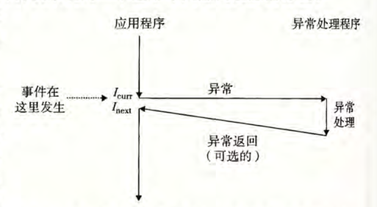

# CSAPP 第8章 异常控制流

从给处理器加电开始，直到断电为止，程序计数器假设一个值的序列：`a0, a1, ... ,an-1`，其中，每个 `ak` 是某个相应的指令 `Ik` 的地址。每次从 `ak` 到 `ak+1` 的过渡称为控制转移（control transfer），这样的控制转移序列叫做处理器的控制流（flow of control 或 control flow）。

最简单的一种控制流是一个“平滑的”序列，其中每个 `Ik` 和 `Ik+1` 在内存中都是相邻的。这种平滑流的**突变**（也就是 `Ik+1` 与 `Ik` 不相邻）通常是由诸如跳转、调用和返回这样一些程序指令造成的。这样一些指令都是必要的机制，使得程序能够对由程序变量表示的内部程序状态中的变化做出反应。

但是系统也必须能够对系统状态的变化做出反应，这些系统状态不是被内部程序变量捕获的，而且也不一定要和程序的执行相关。比如，一个硬件定时器定期产生信号，这个事件必须得到处理。包到达网络适配器后，必须存放在内存中。程序向磁盘请求数据，然后休眠，直到被通知说数据已就绪。当子进程终止时，创建这些子进程的父进程必须得到通知。

*异常控制流*（ECF）是指现代系统通过使控制流发生突变来队这些情况做出反应。

- *理解ECF可以帮助理解重要的系统概念*。ECF是操作系统用来实现I/O、进程和虚拟内存的基本机制
- *帮助理解应用程序是如何与操作系统交互的*。应用程序通过使用一个叫做*陷阱（trap)*或者*系统调用（system call)*的ECF形式，向操作系统请求服务。比如，向磁盘写数据、从网络读取数据、创建一个新进程，以及终止当前进程，都是通过应用程序调用系统调用来实现的
- *编写有趣的新应用程序*。操作系统为应用程序提供了强大的ECF机制，用来创建新进程、等待进程终止、通知其它进程系统中的异常时间，以及检测和响应这些事件。
- *理解并发*。ECF是计算机系统中实现并发的基本机制。在运行中的并发的例子有：中断应用程序执行的异常处理程序，在时间上重叠执行的进程和线程，以及中断应用程序执行的信号处理程序
- *理解软件异常如何工作*。C++和Java这样的语言通过try、catch和throw语句来提供软件异常机制。软件异常允许程序进行非本地跳转（即违法通常的调用/返回栈规则的跳转）来响应错误情况

## 8.1 异常

异常是异常控制流的一种形式，它一部分由硬件实现，一部分由操作系统实现。具体细节随系统的不同而不同

*异常*就是控制流中的突变，用来响应处理器状态中的某些变化。如图8-1所展示的基本思想

|  |
| ------------------------------------------------------------ |
| 图8-1 异常的剖析。处理器状态中的变化（事件）触发从应用程序到异常处理程序的突发的控制转移。在异常处理程序完成处理后，它将控制返回给被中断的程序或者终止 |

当异常处理程序完成后，根据引起异常的事件的类型，会发生以下三种情况的一种

1. 处理程序将控制返回给当前程序*I~current~*,即当事件发生时正在执行的指令
2. 处理程序将控制返回给*I~next~*,如果当前没有发生异常将会执行的下一条指令
3. 处理程序终止被中断的程序

### 8.1.1 异常处理

系统种可能的每种类型的异常都分配了一个唯一的非负整数的*异常号*。其中一些号码是由处理器的设计者分配的，其它号码是由操作系统**内核**（操作系统常驻内存的部分）的设计者分配的。

在系统启动时，操作系统分配和初始化一张称为**异常表**的跳转表，使得表目k包含异常k的处理程序的地址

|  |
| ------------------------------------------------------------ |
| 图 8-2 异常表                                                |

在运行时（系统执行某个程序时），处理器检测到发生了一个事件，并且确定了异常号k。随后，处理器触发异常，方法是执行间接过程调用，通过异常表的表目k，转到相应的处理程序。图8-3展示了处理器如何使用异常表来形成适当的异常处理程序的地址。异常表的起始地址放在一个叫做**异常表基址寄存器**的特殊CPU寄存器中

|  |
| ------------------------------------------------------------ |
| 图8-3 生成异常处理程序的地址。异常号时异常表中的索引         |

异常类似于过程调用，不同之处

- 过程调用时，在跳转到处理程序之前，处理器将返回地址压入栈中。然而，根据异常的类型，返回地址要么时当前指令（当事件发生时正在执行的指令），要么下一条指令
- **处理器也把一些额外的处理器状态压到栈里，在处理程序返回时，重新开始执行被中断的程序会需要这些状态。**

- 如果控制从用户程序转移到内核，所有这些项目都被压到内核栈中，而不是压到用户栈中
- 异常处理程序运行在内核模式下，**这意味着它们对所有的系统资源都有完全访问的权限**

### 8.1.2 异常的类型

异常可以分为四类：中断（interrupt）、陷阱（trap）、故障（fault）和终止（abort）。图 8-4 中的表对这些类别的属性做了小结。

|  |
| ------------------------------------------------------------ |
| 图 8-4 异常的类别 异步异常是由处理器外部的I/O设备中的事件产生的。同步异常是执行一条指令的直接产物 |

1. **中断**

   中断是异步发生的，是来自处理器外部的I/O设备的信号的结果。硬件中断不是由任何一条专门的指令造成的，从这个意义上来说它是异步的。硬件中断的异常处理程序常常称为*中断处理程序*

   图8-5概括了一个中断的处理。I/O设备，例如网络适配器、磁盘控制器和定时芯片，通过向处理器芯片上的一个引脚发信号，并将异常号放到系统总线上，来触发中断，这个异常号标识了引起中断的设备

   |  |
   | ------------------------------------------------------------ |
   | 图8-5 中断处理。中断处理程序将控制返回给应用程序控制流中的下一条指令 |

   当前指令完成执行之后，处理器注意到中断引脚的电压变高了，就从系统总线读取异常号，然后调用适当的中断处理程序。当处理程序返回时，他就将控制返回下一条指令（也就是如果没有发生中断，在控制流中会在当前指令之后的那条指令）。结果时程序继续执行，就像没有发生过中断一样

2. **陷阱和系统调用**

   陷阱是有意的异常，是执行一条指令的结果，就像中断处理程序一样，陷阱处理程序将控制返回到下一条指令。陷阱最重要的用途是在用户程序和内核之间提供一个像过程一样的接口，叫做**系统调用**

   用户程序经常需要向内核请求服务，比如读一个文件（read），创建一个新的进程（fork)、加载一个新的程序（execve)、或者终止当前进程（exit)。为了运行对些内核服务的受控访问，处理器提供了一条特殊的`syscall n`指令，当用户程序想要请求服务`n`时，可以执行这条指令。执行`syscall`指令会导致一个到异常处理程序的陷阱，这个处理程序解析参数，并调用适当的内核程序。图8-6所示

   |  |
   | ------------------------------------------------------------ |
   | 图8-6 陷阱处理。陷阱处理程序将控制返回给应用程序控制流中的下一条指令 |

   从程序员的角度来看，系统调用和普通的函数调用是一样的。然而，它们的实现非常不同。普通的函数运行在用户模式中，用户模式限制了函数可以执行的指令的类型，而且它们只能访问与调用函数相同的栈。系统调用运行在内核模式中，内核模式允许系统调用执行特权指令，并访问定义在内核中的栈。

3. **故障**

   故障由错误情况引起，它可能能够被故障处理程序修正。当故障发生时，处理器将控制转移给故障处理程序。如果处理程序能够修正这个错误情况，它就将控制返回到引起故障的指令，从而重新执行它。否则，处理程序返回到内核中的`abort`例程，`abort`例程会终止引起故障的应用程序。图8-7概述了一个故障的处理

   |  |
   | ------------------------------------------------------------ |
   | 图8-7 故障处理。根据故障是否能够被修复，故障处理程序要么重新执行引起故障的指令，要么终止 |

   > 一个经典的故障示例是缺页异常，当指令引用一个虚拟地址，而与该地址相对应的物理页面不在内存中，因此必须从磁盘中取出时，就会发生故障。就像我们将再第9章中看到的那样，一个页面就是虚拟内存的一个连续的块（典型的是4KB）。缺页处理程序从磁盘加载适当的页面，然后将控制返回给引起故障的指令。当指令再次执行时，相应的物理页面已经驻留在内存中了，指令就可以没有故障地运行完成了。

4. **终止**

   终止是不可恢复地致命错误造成的结果，通常是一些硬件错误，比如DRAM或者SRAM位被损坏时发生的奇偶错误。终止处理程序从不将控制返回给应用程序。如图8-8所示，处理程序将控制返回给一个`abort`例程，该例程会终止这个应用程序

### 8.1.3 Linux/x86-64 系统中的异常

|  |
| ------------------------------------------------------------ |
| 图8-10 Linux x86-64系统中常用的系统调用示例                  |

## 8.2 进程

异常是允许操作系统内核提供*进程（process)*概念的基本构造块

进程的经典定义就是一个执行中程序的示例。系统中的每个程序都运行在某个进程的*上下文(context)*中。上下文是由程序正确运行所需的状态组成的。这个状态包括存放在内存中的程序的代码和数据，它的栈、通用目的寄存器的内存、程序计数器、环境变量以及打开文件描述符的集合

每次用户通过向shell输入一个可执行目标文件的名字，运行程序时，shell就会创建一个新的进程，然后在这个新进程的上下文中运行这个可执行目标文件。应用程序也能够创建新进程，并且在这个新进程的上下文中运行它们自己的代码或其他应用程序

进程提供给应用程序的关键抽象：

- 一个独立的逻辑控制流，它提供一个假象，好像我们的程序独占地使用处理器
- 一个私有的地址空间，它提供一个假象，好像的我们的程序独占地使用内存系统

### 8.2.1 逻辑控制流

即使在系统中通常有许多其它程序在运行，进程也可以向每个程序提供一种假象，好像它在独占地使用处理器。用调试器单步执行程序，我们会看到一系列地程序计数器（PC）的值，这些值唯一地对应于**包含在程序的可执行目标文件中的指令**，或是**包含在运行时动态链接到程序的共享对象中的指令**。这个PC值得序列叫做**逻辑控制流**,即**逻辑流**

|  |
| ------------------------------------------------------------ |
| 图8-12 进程为每个程序提供了一种假象，好像程序在独占地使用处理器。每个竖直的条表示一个进程的逻辑控制流的一部分 |

如图8-12所示。每个进程执行它的流的一部分，然后被**抢占**（暂时挂起），然后轮到其它进程。对于一个运行在这些进程之一的上下文中的程序，它看上去就是像是在独占的使用处理器

### 8.2.2 并发流

一个逻辑流的执行在时间上与另一个流重叠，称为**并发流**。流X和Y互相并发，当且仅当X在Y开始之后和Y结束之前开始，或者Y在X开始之后和X结束之前开始。

> 例如图8-12中，A和B并发地运行

一个进程和其它进程轮流运行地概念称为**多任务**。一个进程执行它的控制流的一部分的每一时间段叫做**时间片**。因此多任务也叫做**时间分片**。

> 例如图8-12中进程A的流由两个时间片组成

如果两个流并发地运行在不同地处理器核或者计算机上，那么我们称它们为**并行流**，它们**并行地运行**，且**并行地执行**

> 并行流是并发流地真子集。
>
> **注意：** 并发流地思想与流运行地处理器核数或者计算机数无关。只要两个流在时间上重叠，那么它们就是并发的，即使它们是运行在同一处理器上。

> [!IMPORTANT]
>
> #### 并发与并行
>
> 1. 并发与并行的本质区别
>    - **并发：** 是任务在**逻辑上同时推进**，但**物理上可能交替执行**。*例如单核CPU通过快速切换线程模拟“同时处理多任务”*
>    - **并行：** 任务在**物理上真正同时执行**，依赖多核、多处理器或多计算机的硬件支持。*例如，两个线程分别运行在两个CPU核心上，同时执行指令*
> 2. 常见误区
>    - **多线程一定是并行的**： 多线程在单核CPU上是并发（交替执行），在多核CPU上才可能并行
>    - **并行一定比并发快**： 并行可能因为资源协调问题导致效率下降

### 8.2.3 私有地址空间

进程也为每个程序提供一种假象，好像它独占地使用系统地址空间。在一台n位地址的机器上，地址空间是2^n^个可能地址的集合，0，1，……，2^n^-1。进程为每个程序提供它自己的**私有地址空间**。一般情况下，和这个空间中某个地址相关联的那个内存字节是不能被其它进程读或者写的

但是每个这样的空间都有相同的通用结构。例如图8-13展示一个x86-64 Linux进程的地址空间的组织结构

地址空间底部是保留给用户程序的，包括通常的代码、数据、堆和栈段。代码段总是从地址0x400000开始。地址空间顶部保留给内核（操作系统常驻内存的部分）。地址空间的这个部分包含在内核代表进程执行指令时使用的代码、数据和栈

|  |
| ------------------------------------------------------------ |
| 图8-13 进程地址空间                                          |

### 8.2.4 用户模式和内核模式⭐

为了使操作系统内核提供一个无懈可击的进程抽象，处理器必须提供一种机制，限制**一个应用可以执行的指令以及它可以访问的地址空间范围**

处理器通常是用某种控制寄存器中的一个**模式位**来提供这种功能的，该寄存器描述了进程当前享有的特权。当设置了模式位时，进程就运行在**内核模式**中（或者**超级用户模式**）。一个运行在内核模式的进程可以执行指令集中的任何指令，并且可以访问系统中的任何内存位置

没有设置模式位时，进程就运行在**用户模式**中。用户模式中的进程不允许执行**特权指令**，比如停止处理器，改变模式位，或者发起一个I/O操作。也不允许用户模式中的进程直接引用地址空间中内核区内的代码和数据。任何这样的尝试都将导致保护故障。**用户程序必须通过系统调用接口间接地访问内核代码和数据**

运行应用程序代码的进程初始时是在用户模式中的。进程从用户模式变为内核模式的唯一方法是通过诸如**中断**、**故障**、或者**陷入系统调用**这样的异常。当异常发生时，控制传递到异常处理程序，处理器将模式从用户模式变为内核模式。处理程序运行在内核模式中，当它返回到应用程序代码时，处理器就把模式从内核模式改回到用户模式。

Linux提供了一种聪明的机制，叫做`/proc`文件系统，它允许用户模式进程访问内核数据结构的内容。`/proc`文件系统将许多内核数据结构的内容输出为一个用户程序可以读的文本文件的层次结构。

> [!TIP]
>
> 比如，你可使用`/proc`文件系统找出一般的系统属性，比如CPU类型`/proc/cpoinfo`，或者某个特殊的进程使用的内存段(`/proc/<process-id>/maps`)
>
> 2.6版本的Linux内核引入`/sys`文件系统，它输出关于系统总线和设备的额外的低层信息

## 8.3 系统调用错误处理

当Unix系统级函数遇到错误时，它们通常会返回`-1`，并设置全局整数变量`errno`来表示什么出错了，程序员应该总是检查错误

## 8.4 进程控制

Unix提供了大量从C程序中操作进程的系统调用

### 8.4.1 获取进程ID

每个进程都有唯一的正数进程ID（PID）。`getpid`函数返回调用进程的PID。`getppid`返回它的父进程的PID

### 8.4.2 创建和终止进程

我们可以认为进程总是处于下面三种状态之一：

- **运行:** 进程要么在CPU上执行，要么在等待被执行且最终会被内核调度
- **停止：** 进程的执行被挂起，且不会被调度